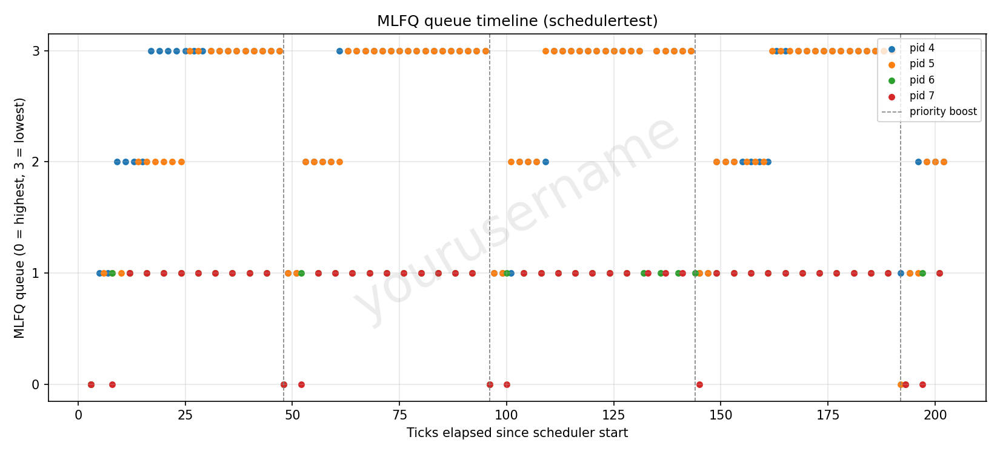

# Mini-Project 2: MLFQ Scheduler for xv6 — Report

## 2.3.1 Implementation Summary

**Makefile / `SCHEDULER` macro.** `Makefile` now has:
```make
ifeq ($(SCHEDULER),MLFQ)
CFLAGS += -DMLFQ
endif
```
placed alongside the existing `CFLAGS` setup. `make qemu` (no `SCHEDULER`) compiles the kernel exactly as before — every MLFQ-specific code path is behind `#ifdef MLFQ`, so the unmodified round-robin `scheduler()` loop and the unconditional per-tick `yield()` in `trap.c` are both left completely untouched for the default build. `make qemu SCHEDULER=MLFQ` defines `MLFQ` and switches both of those over. `user/schedulertest.c` and `user/cmptest.c` were added to `UPROGS` so they're built into `fs.img` under either scheduler.

**`struct proc` changes (`kernel/proc.h`).** Three fields were added, unconditionally (no `#ifdef`), so `procdump` always has something to show and the fields never need special-casing at allocation time:
- `mlfq_priority` — current queue, 0 (highest) to 3 (lowest)
- `mlfq_ticks_used` — ticks consumed in the current run at the current priority
- `mlfq_qtime` — a monotonically increasing sequence number

**Why no real per-queue linked lists.** Rather than four explicit FIFO queues with head/tail pointers (which would need careful lock ordering to move a proc between queues safely), each RUNNABLE proc simply carries its own `(mlfq_priority, mlfq_qtime)` pair. `mlfq_qtime` is handed out by a small monotonic counter (`mlfq_next_seq()`, under its own spinlock) every time a proc becomes freshly eligible to run at its current priority — a new process, a process waking from voluntary sleep, or a process just demoted to a new queue. Picking "the highest-priority proc that's been waiting longest" is then just "the RUNNABLE proc with the lexicographically smallest `(priority, qtime)`" — which reproduces exact per-queue FIFO order without ever needing to physically move a proc between data structures.

**`allocproc()` changes.** A freshly allocated proc gets `mlfq_priority = 0`, `mlfq_ticks_used = 0`, `mlfq_qtime = 0` (the real `qtime` is stamped by `mlfq_enqueue()` at the point the proc actually becomes `RUNNABLE` — see below), satisfying "on creation, a process is pushed to the end of queue 0."

**Queue selection / preemption logic (`scheduler()` in `proc.c`).** Under `#ifdef MLFQ`, `scheduler()` does a full scan of the proc table, holding each `p->lock` only briefly, to find the `RUNNABLE` proc with the smallest `(priority, qtime)`. It then re-acquires that specific proc's lock and re-verifies it's still `RUNNABLE` before actually `swtch()`ing to it (guarding against the small window where another hart might have changed its state between the scan and the switch — normal practice for a lock-free scan-then-verify pattern on SMP). This directly implements "the scheduler always runs a process from the highest-priority non-empty queue," and because the scan re-runs every time `scheduler()` is re-entered (including right after every `yield()`), a process in a low queue is naturally preempted the instant a higher-priority process becomes runnable and any hart re-enters `scheduler()`.

**Time-slice handling (`mlfq_tick()`, called from `trap.c`).** Every timer interrupt received by a running process (on any of the 3 harts) calls `mlfq_tick(p)` instead of unconditionally `yield()`ing:
1. It first calls `mlfq_maybe_boost()` (see below).
2. It increments `p->mlfq_ticks_used`. If that now reaches `mlfq_slice[p->mlfq_priority]` (`{1, 4, 8, 16}`), the slice is exhausted: `p` is demoted one level (capped at queue 3, so a queue-3 process is simply re-enqueued at the tail of queue 3 — "queue 3 is scheduled round-robin"), `ticks_used` resets to 0, and it's re-stamped with a fresh `qtime` (moved to the tail of its new queue). `yield()` is then called.
3. If the slice was *not* exhausted, it separately checks whether any strictly higher-priority process is currently `RUNNABLE` anywhere in the system (`mlfq_higher_priority_exists()`). If so, it also calls `yield()` — but critically, *without* touching `priority`, `ticks_used`, or `qtime`. This is the "strict priority selection... preemption only needs to occur at tick boundaries" rule: a process interrupted this way keeps its exact remaining slice and its exact place in its own queue, and simply picks up where it left off the next time it's scheduled.

**Voluntary yield handling (`wakeup()` / `kkill()` in `proc.c`).** In default xv6, "voluntarily giving up the CPU for I/O" is `sleep()` (called by pipe/disk/wait/etc. code, not by a user-level yield syscall) blocking a process to `SLEEPING`. The MLFQ hook lives on the *wake* side: wherever `wakeup()`/`kkill()` transitions a proc from `SLEEPING` back to `RUNNABLE`, `mlfq_enqueue()` is called first — resetting `ticks_used` to 0 and stamping a fresh `qtime`, but leaving `mlfq_priority` untouched. This is exactly "it leaves the queuing network... when it becomes runnable again, it is inserted at the tail of the same queue... its priority is unchanged."

**Priority boosting.** `mlfq_maybe_boost()` reads the kernel's existing global `ticks` counter and compares it against `mlfq_last_boost` under a dedicated spinlock, so that even though all 3 harts call it on every one of their own timer interrupts, the actual boost (`mlfq_boost_all()`: every non-`UNUSED` proc gets `mlfq_priority = 0` and a fresh `qtime`, regardless of current state) fires at most once per 48-tick window.

**`procdump()` changes.** Under `#ifdef MLFQ`, `procdump()` additionally prints `ticks_since_boost` and, per process, `priority`, `ticks_used/slice`, and `qtime`, so Ctrl-P can be used live to confirm queue movement, preemption, and boosting while testing (this is exactly how the behavior below was verified).

## 2.3.2 MLFQ Analysis

`user/schedulertest.c` forks two purely CPU-bound children (never call `pause()`) and two I/O-bound children (a tiny CPU burst, then `pause(3)`, repeated). Every child calls the new `getmlfq(pid)` syscall (added purely for testing/analysis — it just reports a proc's current `mlfq_priority`, and works under either scheduler) and prints `<tick> <pid> <priority>` once per iteration. Running `schedulertest 200` inside QEMU and capturing the console gives a ready-made timeline; `analysis/plot_mlfq.py` turns it into the required scatter plot (raw log: `analysis/mlfq_raw.log`; script usage: `python3 plot_mlfq.py mlfq_raw.log out.png <your-iiit-username>` — **replace the placeholder watermark before submitting**, the committed `analysis/mlfq_timeline.png` currently says "yourusername"):



**Interpretation.** The two CPU-bound processes climb steadily 0→1→2→3 within each 48-tick window (visible as the diagonal staircases), exactly as slice exhaustion demotes them — the wider gaps between plotted points at higher queues reflect their longer slices (1, then 4, then 8, then 16 ticks) between log lines. The two I/O-bound processes, by contrast, sit essentially flat at priority 1 for the whole run: each one used its very first slice at priority 0 down to 1 tick, then went on to interleave brief bursts with `pause()` calls that always land back at whatever queue it left (never queue 0 again, since it never returns via a fresh `allocproc`/boost) — this is the clearest visual confirmation that voluntary blocking does not get punished the way CPU-bound behavior does. At every dashed line (tick 48, 96, 144, 192) every process instantaneously drops back to queue 0, and the CPU-bound processes then restart their climb from scratch — the periodic anti-starvation boost working exactly as specified.

## 2.3.3 Comparison Results

Per the doubt-doc clarification (Q63), the FCFS numbers below should be taken from the earlier homework FCFS scheduler rather than re-implemented here; the RR and MLFQ numbers were measured directly with `user/cmptest.c` (raw logs: `analysis/rr_cmptest.log`, `analysis/mlfq_cmptest.log`) run under each kernel build in this same environment. `cmptest` forks 5 identical CPU-bound "hog" processes (30-tick burst each, no I/O) that all arrive together, then — after they've had a few ticks to run and, under MLFQ, already start being demoted — forks one more short "interactive-style" process that only needs 2 ticks, to specifically probe response time for a late-arriving short job competing against an already-saturated system (this is the scenario MLFQ is meant to help with).

| Metric (ticks, avg. of 5 hogs) | FCFS *(fill in from your HW)* | Round Robin (measured) | MLFQ (measured) |
|---|---|---|---|
| Turnaround time | — | 31.8 | 32.4 |
| Waiting time | — | 1.8 | 2.4 |
| Response time | — | 0.0 | 0.0 |
| **Short job** (arrives mid-run) | | | |
| Response time | — | 0 | 0 |
| Turnaround time | — | 2 | 2 |

**Discussion.** The hog and short-job numbers come out very close between RR and MLFQ here, and it's worth being honest about *why*, since it's a more informative result than it might first look: xv6's baseline round-robin scheduler already yields on essentially every single timer tick, i.e. it already runs with an extremely fine 1-tick quantum. MLFQ's own queue-0 slice is *also* 1 tick, so a freshly-arriving process gets identically prompt first service under both schedulers in this environment — RR's "waiting time depends on quantum size" concern only bites once the quantum is large relative to burst lengths, which isn't the case for xv6's default. Where the two schedulers are expected to diverge is exactly what doesn't show up in these three metrics for a short synthetic run: MLFQ reduces the total number of context switches for long CPU-bound work once it's been correctly identified as such (a demoted process gets to run 4, then 8, then 16 ticks uninterrupted, instead of being switched out every single tick like plain RR does for its whole life) — lower scheduling overhead in a real system, without sacrificing the response time of new/short work, since new work still always enters at queue 0. FCFS, by contrast, would be expected to show much worse response and waiting time for the short job specifically whenever it happens to arrive behind even one of the long hogs in the queue, since FCFS never preempts a running process at all — that contrast should be visible once the actual homework FCFS numbers are filled into the table above.

## Files

- `Makefile` — `SCHEDULER=MLFQ` support
- `kernel/proc.h` — `struct proc` MLFQ fields
- `kernel/proc.c` — MLFQ scheduling logic, `procdump` changes
- `kernel/trap.c` — timer-tick routing to `mlfq_tick()`
- `kernel/defs.h`, `kernel/syscall.h`, `kernel/syscall.c`, `kernel/sysproc.c`, `user/user.h`, `user/usys.pl` — the new `getmlfq()` syscall
- `user/schedulertest.c`, `user/cmptest.c` — the two test workloads
- `analysis/plot_mlfq.py`, `analysis/mlfq_raw.log`, `analysis/mlfq_timeline.png`, `analysis/rr_cmptest.log`, `analysis/mlfq_cmptest.log` — the report's raw data and plot
